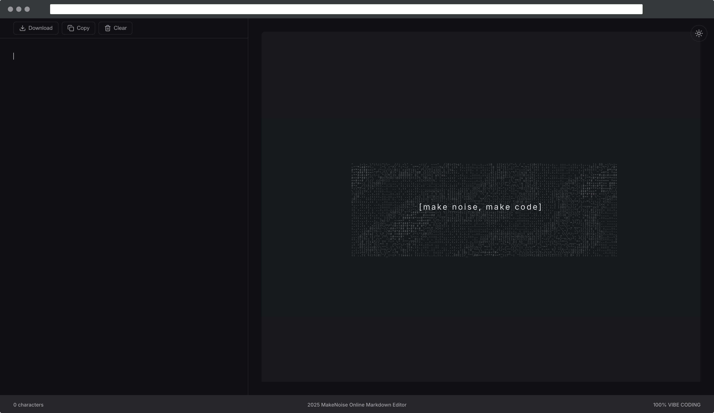

# MakeNoise Markdown Editor

<p align="center">
  
</p>

<h2 align="center">make noise, make code</h2>

<p align="center">
  <a href="./README.md">English</a> | <a href="./README-ja.md">日本語</a>
</p>

<p align="center">
  <strong>A minimalist, vibe-driven Markdown editor for the creative soul.</strong><br/>
  Turn the beautiful chaos of your thoughts into elegant, structured text.
</p>

<p align="center">
  <a href="https://initt.github.io/makenoise/" target="_blank">
    <strong>🚀 Try the Live Demo</strong>
  </a>
</p>



---

**MakeNoise** is not just a Markdown editor. It's a space designed to celebrate the creative process. We believe that writing, coding, and creating are acts of "making noise"—transforming silence and chaos into something meaningful.

When you open the editor and face a blank page, you're greeted by a mesmerizing fluid animation. This isn't just a placeholder; it's a representation of the creative potential swirling in your mind. It's the beautiful noise of ideas waiting to be born. As you begin to type, the chaos recedes, giving way to your words, your code, your story.

This is a tool for writers, developers, dreamers, and anyone who finds joy in the act of creation.

## ✨ Features

*   **Live Preview:** See your rendered Markdown instantly.
*   **Distraction-Free UI:** A clean, minimal interface that keeps you focused.
*   **Fluid Animation:** A unique generative art display on the preview panel when the editor is empty, inspiring creativity.
*   **Resizable Panes:** Adjust the editor and preview panes to your liking with a simple drag.
*   **Light & Dark Themes:** Switch between themes to match your mood and environment.
*   **Persistent Memory:** Your work is automatically saved to local storage, so you never lose it.
*   **Essential Actions:** Quickly download, copy, or clear your Markdown.
*   **Built with Modern Tech:** Crafted with Vue 3, Vite, and TypeScript for a fast and reliable experience.

## 🚀 Getting Started

**🎯 Quick Start:** [Try the live demo](https://initt.github.io/makenoise/) to experience MakeNoise Markdown Editor right now!

1.  **Clone the repository:**
    ```bash
    git clone https://github.com/initt/makenoise.git
cd makenoise
    ```

2.  **Install dependencies:**
    ```bash
    # Using pnpm (recommended)
    pnpm install

    # Or with npm
    npm install
    ```

3.  **Run the development server:**
    ```bash
    pnpm dev
    ```

4.  Open your browser and navigate to `http://localhost:5173` (or the address shown in your terminal).

## 🛠️ Tech Stack

*   **Framework:** [Vue 3](https://vuejs.org/)
*   **Build Tool:** [Vite](https://vitejs.dev/)
*   **Language:** [TypeScript](https://www.typescriptlang.org/)
*   **Markdown Parsing:** [Marked](https://marked.js.org/)
*   **Animation:** [Anime.js](https://animejs.com/)
*   **Icons:** [Lucide](https://lucide.dev/)

## 📄 License

This project is licensed under the MIT License.